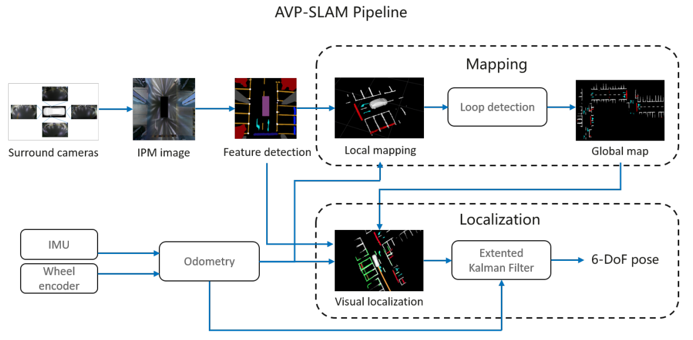
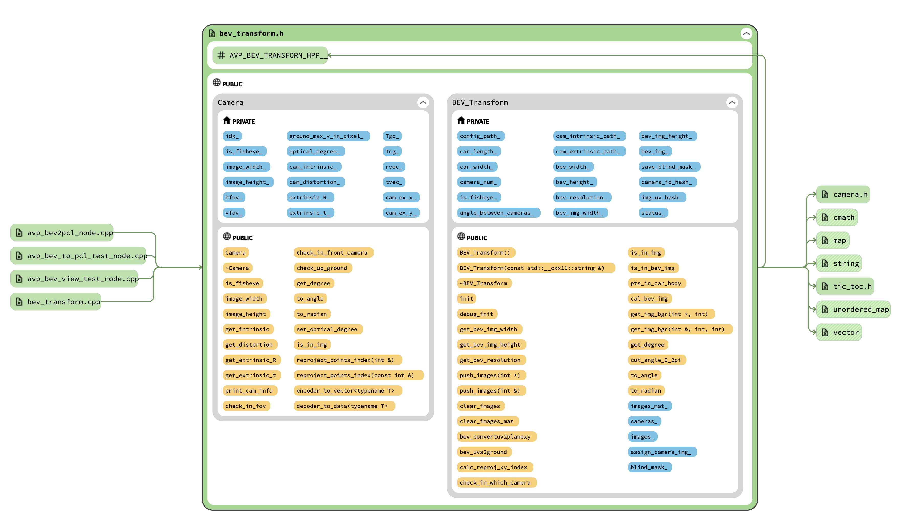

# AVP-SLAM-SIM

A basic implementation of [AVP-SLAM: Semantic Visual Mapping and Localization for Autonomous Vehicles in the Parking Lot(IROS 2020)](https://arxiv.org/abs/2007.01813) in simulation.

**Respect to AVP-SLAM project -> Tong Qin, Tongqing Chen, Yilun Chen, and Qing Su**

[![Contributors][contributors-shield]][contributors-url]
[![Forks][forks-shield]][forks-url]
[![Stargazers][stars-shield]][stars-url]
[![Issues][issues-shield]][issues-url]

<!-- PROJECT LOGO -->
<br />
<p align="center">
  <a href="https://github.com/TurtleZhong/AVP-SLAM-SIM">
    
  </a>

  <h3 align="center">AVP-SLAM-SIM</h3>

  <p align="center">
    A basic implementation of <a href="https://arxiv.org/abs/2007.01813">AVP-SLAM: Semantic Visual Mapping and Localization for Autonomous Vehicles in the Parking Lot(IROS 2020)</a> in simulation!
    <br />
    <a href="https://github.com/TurtleZhong/AVP-SLAM-SIM">View Demo</a>
    ·
    <a href="https://github.com/TurtleZhong/AVP-SLAM-SIM/issues">Report Bug</a>
    ·
    <a href="https://github.com/TurtleZhong/AVP-SLAM-SIM">Request Feature</a>
  </p>
</p>

<!-- TABLE OF CONTENTS -->
<details open="open">
  <summary>Table of Contents</summary>
  <ol>
    <li>
      <a href="#about-the-project">About The Project</a>
    </li>
    <li><a href="#codestructure">CodeStructure</a></li>
    <li><a href="#how to run">How to run</a></li>
    <li><a href="#roadmap">Roadmap</a></li>
    <li><a href="#contributing">Contributing</a></li>
    <li><a href="#license">License</a></li>
    <li><a href="#contact">Contact</a></li>
    <li><a href="#acknowledgements">Acknowledgements</a></li>
  </ol>
</details>

<!-- ABOUT THE PROJECT -->
### About The Project
<p align="center">
  <a href="(https://arxiv.org/abs/2007.01813)">
    
  </a>
</p>


&emsp;&emsp; This project is only my implementation of the Paper, **not official release** , we only release our simulation codes. **`Other Code will be released soon`**

<!-- CodeStructure -->
### CodeStructure
&emsp;&emsp;We release our basic code structure, for the whole project, you need at least `calib`,`segmentation`,[avp-bev](https://github.com/TurtleZhong/avp-bev-open),`sync part` etc. [avp-bev](https://github.com/TurtleZhong/avp-bev-open) is one of the core parts of this project, The struct show in the figure:

<p align="center">
  <a href="(https://arxiv.org/abs/2007.01813)">
    
  </a>
</p>

&emsp;&emsp;If you are intrested in this project, you can follow the `***.h` files to relize your implementation.

### How to run

&emsp;&emsp; This project provide a gazebo world. so if you wanna test the code, you need prepare the simulation world.

&emsp;&emsp; This project need a gazebo environment, Usually loading the gazebo models takes long time, so we need to download the models first and put them in `~/.gazebo/models/`.

Follow this [link](https://blog.csdn.net/qq_36170626/article/details/90417359),Download the models from [BaiDu YUN](http://pan.baidu.com/s/1pKaeg0F), The extract code `cmxc`, and unzip them in `~/.gazebo/models/`. or you can Download the models [Google Drive LINK](https://drive.google.com/file/d/12ZZ0X_twp29xiYeABAQbcJKaVh0e01c3/view?usp=sharing).

```bash
mkdir -p ~/catkin_ws/src && cd catkin_ws/src
git clone https://github.com/TurtleZhong/AVP-SLAM-SIM.git
cd gazebo_files/
unzip my_ground_plane.zip -d ~/.gazebo/models/

cd ../
catkin init && catkin config -DCMAKE_BUILD_TYPE=Release
catkin build
```
```bash
source devel/setup.bash
roslaunch avp_gazebo single_simulated_avp.launch
```

If everything is OK, you will get this:
<p align="center">
  <a href="">
    
  </a>
</p>


<!-- ROADMAP -->
### Roadmap

* [ADAS]()
* [AVP]()
* [......]()


<!-- CONTRIBUTING -->
### Contributing

Contributions are what make the open source community such an amazing place to be learn, inspire, and create. Any contributions you make are **greatly appreciated**.

1. Fork the Project
2. Create your Feature Branch (`git checkout -b feature/AmazingFeature`)
3. Commit your Changes (`git commit -m 'Add some AmazingFeature'`)
4. Push to the Branch (`git push origin feature/AmazingFeature`)
5. Open a Pull Request


<!-- LICENSE -->
### License

Distributed under the MIT License.


<!-- CONTACT -->
### Contact

Xinliang Zhong - [@zxl](null) - xinliangzhong@foxmail.com

Wenxuan Chen - [@wxchen](null) - wxchen@example.com

Project Link: [https://github.com/TurtleZhong/AVP-SLAM-SIM](https://github.com/TurtleZhong/AVP-SLAM-SIM)


<!-- ACKNOWLEDGEMENTS -->
### Acknowledgements
* [AVP-SLAM](https://arxiv.org/abs/2007.01813)
* [avp-bev-open](https://github.com/TurtleZhong/avp-bev-open)
* [Open CV](https://opencv.org/)
* [ROS](http://wiki.ros.org/)
* [Gazebo](http://gazebosim.org/)


<!-- MARKDOWN LINKS & IMAGES -->
<!-- https://www.markdownguide.org/basic-syntax/#reference-style-links -->
[contributors-shield]: https://img.shields.io/github/contributors/TurtleZhong/AVP-SLAM-SIM.svg?style=for-the-badge
[contributors-url]: https://github.com/TurtleZhong/AVP-SLAM-SIM/graphs/contributors
[forks-shield]: https://img.shields.io/github/forks/TurtleZhong/AVP-SLAM-SIM.svg?style=for-the-badge
[forks-url]: https://github.com/TurtleZhong/AVP-SLAM-SIM/network/members
[stars-shield]: https://img.shields.io/github/stars/TurtleZhong/AVP-SLAM-SIM.svg?style=for-the-badge
[stars-url]: https://github.com/TurtleZhong/AVP-SLAM-SIM/stargazers
[issues-shield]: https://img.shields.io/github/issues/TurtleZhong/AVP-SLAM-SIM.svg?style=for-the-badge
[issues-url]: https://github.com/TurtleZhong/AVP-SLAM-SIM/issues
[license-shield]: https://img.shields.io/github/license/TurtleZhong/AVP-SLAM-SIM.svg?style=for-the-badge
[license-url]: https://github.com/TurtleZhong/AVP-SLAM-SIM/blob/master/LICENSE.txt
[linkedin-shield]: https://img.shields.io/badge/-LinkedIn-black.svg?style=for-the-badge&logo=linkedin&colorB=555
[linkedin-url]: https://linkedin.com/in/TurtleZhong


